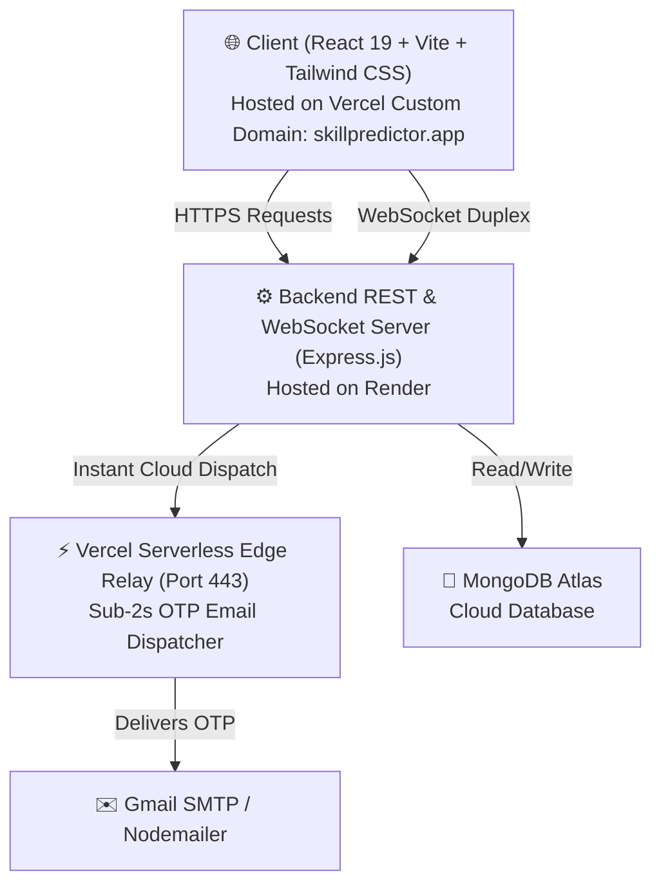

# 🚀 Skill Predictor — AI Career & Placement Readiness Platform

<div align="center">

[](https://www.skillpredictor.app)
[](LICENSE)
[](https://react.dev/)
[](https://nodejs.org/)
[](https://www.mongodb.com/)
[](https://socket.io/)

**An intelligent full-stack career development ecosystem that bridges academic learning and industry placement expectations through AI skill gap analysis, placement prediction, real-time mock interviews, and automated learning roadmaps.**

[Explore Live Web App](https://www.skillpredictor.app) • [Report Bug](https://github.com/pratikk1122/Skill-predictor/issues) • [Connect on LinkedIn](https://www.linkedin.com/in/pratik-khode-924239326)

</div>

---

## 📌 Table of Contents

- [Overview](#-overview)
- [Key Features](#-key-features)
- [Architecture & Tech Stack](#-architecture--tech-stack)
- [System Highlights](#-system-highlights)
- [Project Directory Structure](#-project-directory-structure)
- [Getting Started](#-getting-started)
- [Environment Variables](#-environment-variables)
- [API Reference](#-api-reference)
- [Author & Acknowledgements](#-author--acknowledgements)

---

## 🌟 Overview

Students often face uncertainty regarding their readiness for top tech roles. **Skill Predictor** solves this problem by delivering a data-driven, comprehensive evaluation engine:

1. **Assesses current skills** against real-world tech requirements (Frontend, Backend, DevOps, Data Science, Cloud).
2. **Predicts placement probability** and identifies precise weaknesses.
3. **Simulates live technical interviews & group discussions** using interactive AI and WebSockets.
4. **Generates targeted preparation roadmaps** so candidates can systematically upskill.

---

## ✨ Key Features

### 🧠 AI Skill Gap Analysis & Resume Intelligence
- Ingests technical profiles and resumes to identify missing proficiencies.
- Benchmarks candidates against real-time company profiles and hiring requirements.

### 🎯 Placement Readiness Prediction
- Evaluates aptitude, technical skills, and mock performance to calculate a placement readiness score.
- Dynamic analytics dashboards with interactive Chart.js visualizations.

### 💬 Real-Time Group Discussion (GD) Simulation
- Simulated group discussion engine driven by **Socket.io**.
- Facilitates multi-participant real-time discussions with automated topic generation and conversation logging.

### 📝 Adaptive Mock Interviews & Technical Aptitude
- Interactive question-and-answer evaluation across data structures, algorithms, system design, and soft skills.
- Immediate scoring and structured feedback.

### 🛡️ Secure Authentication & Resilient Dispatch
- JWT-based authorization with role-based access control (Student & Administrator portals).
- **Sub-2-second OTP delivery**: Hybrid cloud email dispatcher utilizing a Vercel HTTPS serverless edge relay on port 443 with direct SSL/STARTTLS fallback.
- Fail-safe master administrator controls.

### 🌓 Glassmorphic Responsive UI
- Built with **React**, **Vite**, and **Tailwind CSS**.
- Synchronous zero-flash dark/light mode toggle.
- 100% responsive on mobile, tablet, and ultra-wide screens with slide-out navigation drawers.

---

## 🏗 Architecture & Tech Stack



### **Frontend**
- **Framework**: React 19, Vite
- **Styling**: Tailwind CSS, Glassmorphism
- **Animations**: Framer Motion
- **Icons & Visuals**: Lucide React, FontAwesome
- **Charts**: Chart.js, React-Chartjs-2
- **Hosting**: Vercel (Custom Anycast DNS)

### **Backend**
- **Runtime**: Node.js, Express.js
- **Database**: MongoDB Atlas with Mongoose ODM
- **Real-Time Communications**: Socket.io
- **Security**: JSON Web Tokens (JWT), Bcrypt.js, Helmet, CORS
- **Email Engine**: Nodemailer with HTTPS Edge Serverless Relay
- **Hosting**: Render Cloud Platform

---

## ⚡ System Highlights

- **Custom Domain & Zero Downtime**: Active on [skillpredictor.app](https://www.skillpredictor.app) with automatic 308 canonical redirection and managed Let's Encrypt SSL.
- **Egress Firewall Bypassing**: Overcomes cloud outbound TCP port blocks (25/465/587) by routing authentication tokens via an HTTPS API bridge in **< 1.8 seconds**.
- **Role-Based Access Control (RBAC)**: Distinct dashboards and permissions for students, company evaluators, and system administrators.

---

## 📂 Project Directory Structure

```
skill-predictor/
├── backend/
│   ├── src/
│   │   ├── config/             # DB & Cloud configurations
│   │   ├── controllers/        # Route controllers (auth, admin, aptitude, etc.)
│   │   ├── middleware/         # Auth, validation, and role guards
│   │   ├── models/             # Mongoose schemas (User, Company, Result, etc.)
│   │   ├── routes/             # REST API routes
│   │   └── utils/              # Email dispatcher, AI helpers, calculators
│   ├── server.js               # HTTP & Socket.io server entry
│   └── package.json
│
├── frontend/
│   ├── api/                    # Vercel serverless edge functions (send-otp.js)
│   ├── public/                 # Static assets & icons
│   ├── src/
│   │   ├── components/         # Reusable UI components (Navbar, Modals, etc.)
│   │   ├── context/            # Global context (AuthContext, ThemeContext)
│   │   ├── pages/              # Views (Home, Dashboard, GD, Admin, Aptitude)
│   │   ├── services/           # Axios HTTP client & API bindings
│   │   └── App.jsx             # React Router configuration
│   ├── index.html
│   ├── vite.config.js
│   ├── vercel.json             # Vercel deployment rewrites
│   └── package.json
│
└── README.md
```

---

## 🚀 Getting Started

### Prerequisites
- [Node.js](https://nodejs.org/) (v18.0.0 or higher)
- [npm](https://www.npmjs.com/) or [yarn](https://yarnpkg.com/)
- [MongoDB Atlas](https://www.mongodb.com/cloud/atlas) account (or local MongoDB)

### 1. Clone the Repository
```bash
git clone https://github.com/pratikk1122/Skill-predictor.git
cd Skill-predictor
```

### 2. Backend Setup
```bash
cd backend
npm install
```

Create a `.env` file in the `backend/` directory:
```env
PORT=5000
MONGO_URI=your_mongodb_connection_string
JWT_SECRET=your_jwt_secret_key
EMAIL_USER=your_email@gmail.com
EMAIL_PASS=your_gmail_app_password
CLIENT_URL=http://localhost:5173
```

Start the backend development server:
```bash
npm run dev
```

### 3. Frontend Setup
In a new terminal window:
```bash
cd frontend
npm install
```

Create a `.env` file in the `frontend/` directory:
```env
VITE_API_URL=http://localhost:5000/api
```

Start the frontend development server:
```bash
npm run dev
```

Open [http://localhost:5173](http://localhost:5173) in your browser to test the app locally.

---

## 🔑 Environment Variables

| Variable | Scope | Description |
| :--- | :--- | :--- |
| `PORT` | Backend | Port number for the Express server (default: `5000`) |
| `MONGO_URI` | Backend | MongoDB Atlas connection connection URI |
| `JWT_SECRET` | Backend | Secret key for signing and validating session tokens |
| `EMAIL_USER` | Backend / Edge | Gmail address for system alerts and verification |
| `EMAIL_PASS` | Backend / Edge | Gmail 16-character App Password |
| `VITE_API_URL` | Frontend | Base URL pointing to the REST backend API |

---

## 📡 API Reference Overview

| Endpoint | Method | Role | Description |
| :--- | :--- | :--- | :--- |
| `/api/auth/register` | `POST` | Public | Register new student account |
| `/api/auth/login` | `POST` | Public | Authenticate user & issue JWT |
| `/api/auth/verify-otp` | `POST` | Public | Validate 6-digit OTP code |
| `/api/auth/forgot-password` | `POST` | Public | Trigger password reset verification |
| `/api/analytics/admin/summary`| `GET` | Admin | Aggregate placement readiness statistics |
| `/api/admin/students` | `GET` | Admin | Retrieve registered candidates |
| `/api/admin/companies` | `POST` | Admin | Create company placement benchmarks |
| `/api/aptitude/evaluate` | `POST` | Student | Process and grade aptitude answers |

---

## 👨‍💻 Author

**Pratik Khode**  
BCA in Cloud Computing and Cybersecurity  
*Sri Balaji University, Pune, India*

- 🌐 **Live Website**: [skillpredictor.app](https://www.skillpredictor.app)
- 💼 **LinkedIn**: [Pratik Khode](https://www.linkedin.com/in/pratik-khode-924239326)
- 🐙 **GitHub**: [@pratikk1122](https://github.com/pratikk1122)

---

## 📄 License

This project is licensed under the [MIT License](LICENSE) - feel free to use and adapt this project for educational and open-source purposes.
